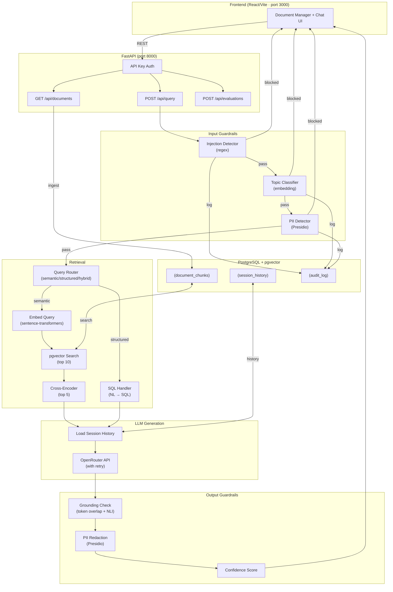
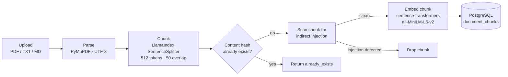
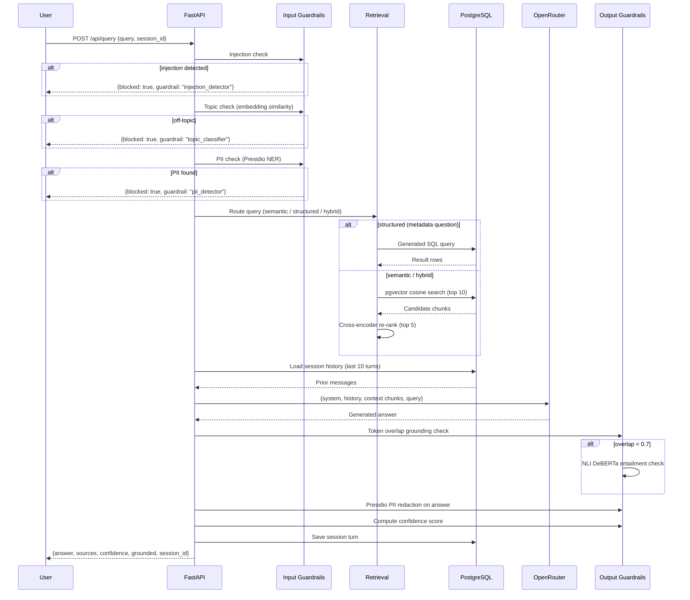
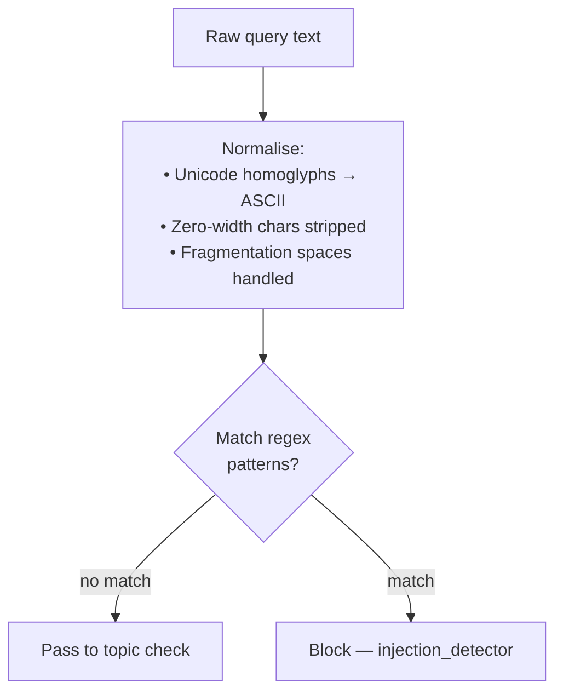
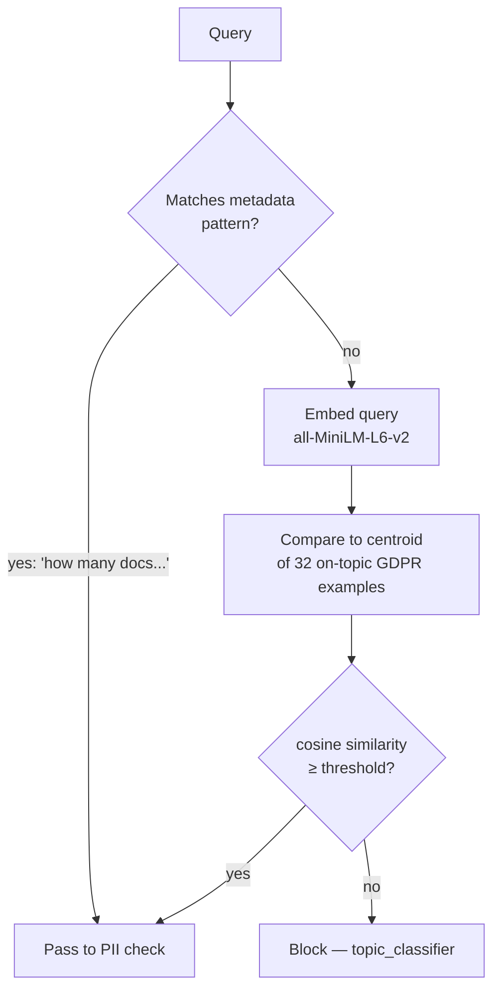
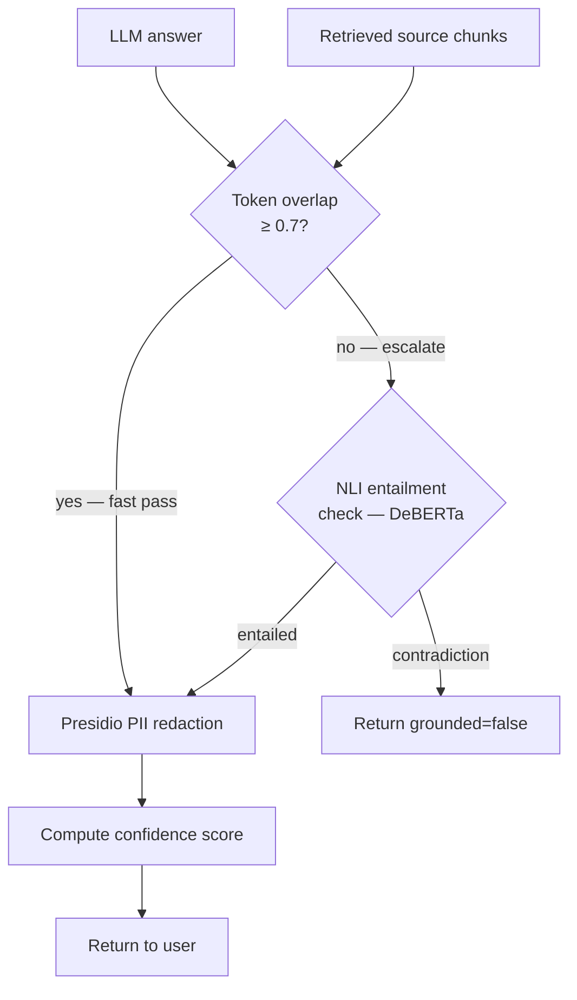
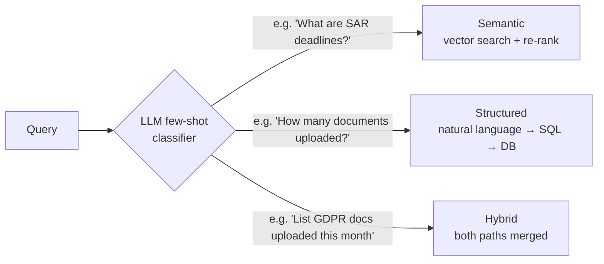

# Project 2 — RAG with Guardrails

A production-grade Retrieval-Augmented Generation (RAG) system for GDPR and compliance document Q&A, with a multi-layer guardrail pipeline that fires on both sides of the LLM. Built as a portfolio project to demonstrate that adding AI to a regulated domain is not just a matter of calling an LLM — it requires defence-in-depth.

---

## What it does

Users upload compliance documents (PDF, TXT, MD). They can then ask questions about them in natural language. Every query passes through three input guardrails before retrieval, and two output guardrails before the answer is returned. Off-topic questions, prompt injection attempts, and PII-containing queries are blocked before the LLM is ever called.

---

## Architecture Overview



---

## Ingestion Pipeline

When a document is uploaded it is processed once and never re-processed:



**Why pre-compute embeddings?** Embeddings are ~5ms per chunk with the model warm. A 50-page PDF produces ~200 chunks. Computing them at query time (on every request) would add a second of latency per document — instead it's a one-time cost at upload.

---

## Query Pipeline



---

## Input Guardrails — Why Three Different Techniques

Each guardrail solves a fundamentally different problem:

| Guardrail | Problem | Right tool | Wrong tool |
|---|---|---|---|
| Injection | Does text contain a specific attack *pattern*? | Regex on normalised input | Embeddings — semantic similarity misses structural obfuscation |
| Topic | Is the *meaning* in the right domain? | Embedding cosine vs centroid | Regex — "data" appears in football transfer news |
| PII | Are there real *named entities* in the text? | NER model (Presidio) | Either — needs span-level entity recognition |

### Injection Detector



Fragmentation attacks (`I g n o r e  a l l`) are caught by patterns with `\s*` between characters. Unicode homoglyphs (Cyrillic о vs Latin o) are normalised before matching.

### Topic Classifier



The centroid is the average vector of 32 example sentences covering all aspects of GDPR: data subject rights, controller obligations, SAR deadlines, breach notification, etc. Any query that lands in that embedding neighbourhood passes.

### PII Detector

Uses Microsoft Presidio (MIT licence) with 40+ entity types: names, emails, phone numbers, SSNs, IBANs, passport numbers, IP addresses. The same engine is reused at the output stage to redact PII that the LLM might echo from source documents.

---

## Output Guardrails — Two-Tier Grounding



**Why two tiers?** Token overlap is near-instant but misses logical contradictions:

```
source: "data must not be retained beyond its purpose"
answer: "data can be kept indefinitely"

token overlap: "data", "be", "kept" all appear → would pass (wrong)
NLI (DeBERTa): reads both texts, detects contradiction → correct
```

Running NLI on every response would add ~200ms. Running it only when token overlap fails keeps the average latency low while catching hallucinations the fast check misses.

**Confidence score** is a weighted combination of values already in the pipeline:

```
confidence = 0.6 × sigmoid(mean retrieval score)
           + 0.4 × token overlap ratio
```

No extra computation. The retrieval scores come from pgvector; the overlap ratio from the grounding check that already ran.

---

## Query Routing — Semantic vs Structured

A few-shot LLM classifier decides how to handle each query before retrieval:



Structured queries bypass vector search entirely — a SQL handler translates the question to a safe `SELECT` (validated to only touch the `documents` table) and the LLM wraps the result in a natural sentence.

---

## Tech Stack

| Layer | Technology |
|---|---|
| Frontend | React 18, TypeScript, Vite, TanStack Query |
| API | FastAPI, Pydantic v2, slowapi (rate limiting) |
| Database | PostgreSQL 17 + pgvector extension |
| ORM | SQLAlchemy 2 (async) + Alembic migrations |
| Embeddings | `all-MiniLM-L6-v2` via sentence-transformers |
| Re-ranking | `cross-encoder/ms-marco-MiniLM-L-6-v2` |
| Grounding NLI | `cross-encoder/nli-deberta-v3-small` |
| PII Detection | Microsoft Presidio + spaCy |
| LLM | OpenRouter (model-agnostic — swap via config) |
| Evaluation | Ragas (async background task) |
| Parsing | PyMuPDF (PDF), LlamaIndex SentenceSplitter |
| Observability | structlog, OpenTelemetry, Prometheus |
| Containerisation | Docker Compose (db + api + frontend) |

---

## Running Locally

**Prerequisites:** Docker Desktop, an OpenRouter API key.

```bash
# 1. Clone and configure
git clone https://github.com/YOUR_USERNAME/project-2-rag-with-guardrails.git
cd project-2-rag-with-guardrails
cp .env.example .env
# Edit .env — set OPENROUTER_API_KEY and API_KEY

# 2. Start the stack (builds images, runs migrations, starts all services)
docker compose up -d

# 3. Open the UI
open http://localhost:3000

# 4. Run integration tests (requires stack running)
pytest tests/integration/ -v --no-cov

# 5. Run e2e tests
pytest tests/e2e/ -v --no-cov
```

**Unit tests** (no Docker required):
```bash
pip install -e ".[dev]"
pytest tests/unit/ -v --no-cov
```

---

## API

All routes except `GET /api/health` require `X-API-Key` header.

| Method | Path | Description |
|---|---|---|
| `GET` | `/api/health` | Health check — public |
| `POST` | `/api/query` | Ask a question |
| `GET` | `/api/documents` | List uploaded documents |
| `POST` | `/api/documents/upload` | Upload a document |
| `GET` | `/api/documents/{id}` | Get document status |
| `DELETE` | `/api/documents/{id}` | Delete document and chunks |
| `POST` | `/api/evaluations` | Start a Ragas evaluation run |
| `GET` | `/api/evaluations/{run_id}` | Poll evaluation status |
| `GET` | `/api/evaluations/{run_id}/results` | Get evaluation scores |

### Example query

```bash
curl -X POST http://localhost:8000/api/query \
  -H "X-API-Key: your-key" \
  -H "Content-Type: application/json" \
  -d '{
    "query": "How long must we retain personal data under GDPR?",
    "session_id": "my-session-001"
  }'
```

```json
{
  "blocked": false,
  "answer": "Under GDPR Article 5(1)(e), personal data must not be kept for longer than is necessary for the purposes for which it is processed...",
  "sources": ["chunk text 1", "chunk text 2", "chunk text 3"],
  "confidence": 0.84,
  "grounded": true,
  "session_id": "my-session-001"
}
```

---

## Project Structure

```
src/rag_guardrails/
├── api/
│   ├── routes/          # FastAPI route handlers
│   │   ├── query.py     # Query pipeline + routing
│   │   ├── documents.py # Document lifecycle
│   │   └── evaluations.py # Async Ragas evaluation
│   └── dependencies.py  # API key auth
├── guardrails/
│   ├── input_guards.py  # Injection, topic, PII (input)
│   └── output_guards.py # Grounding, PII redaction (output)
├── retrieval/
│   ├── query_router.py  # Semantic / structured / hybrid classifier
│   └── structured_handler.py # NL → SQL for metadata queries
├── ingestion/           # Document parsing, chunking, embedding
├── models/              # SQLAlchemy ORM models
├── core/                # Config, database, logging
└── evaluation/          # Ragas runner

tests/
├── unit/                # Fast, no external deps
├── integration/         # Against live Docker stack (port 8000)
└── e2e/                 # Full adversarial scenarios
```

---

## Design Decisions

**Why not one big guardrail?** A single LLM-based "is this safe?" check is tempting but wrong. It would be slow (every query makes an extra LLM call), expensive, non-deterministic, and can itself be prompt-injected. The three-technique approach uses the cheapest correct tool for each problem.

**Why pgvector over a dedicated vector DB?** The knowledge base fits in a single Postgres instance already used for everything else. Eliminating a second stateful service reduces operational complexity with no retrieval quality penalty at this scale.

**Why OpenRouter?** A single API key that routes to any major LLM. Changing models (Claude → GPT-4o-mini → Gemini) is a one-line config change. For a compliance use case where the "best" model may change based on cost/quality trade-offs, this is practical.

**Why two-tier grounding?** Token overlap is O(n) and catches most clean cases. NLI (DeBERTa) is accurate but ~200ms. Running NLI only when overlap fails keeps p50 latency low while catching logical contradictions the fast check misses.
